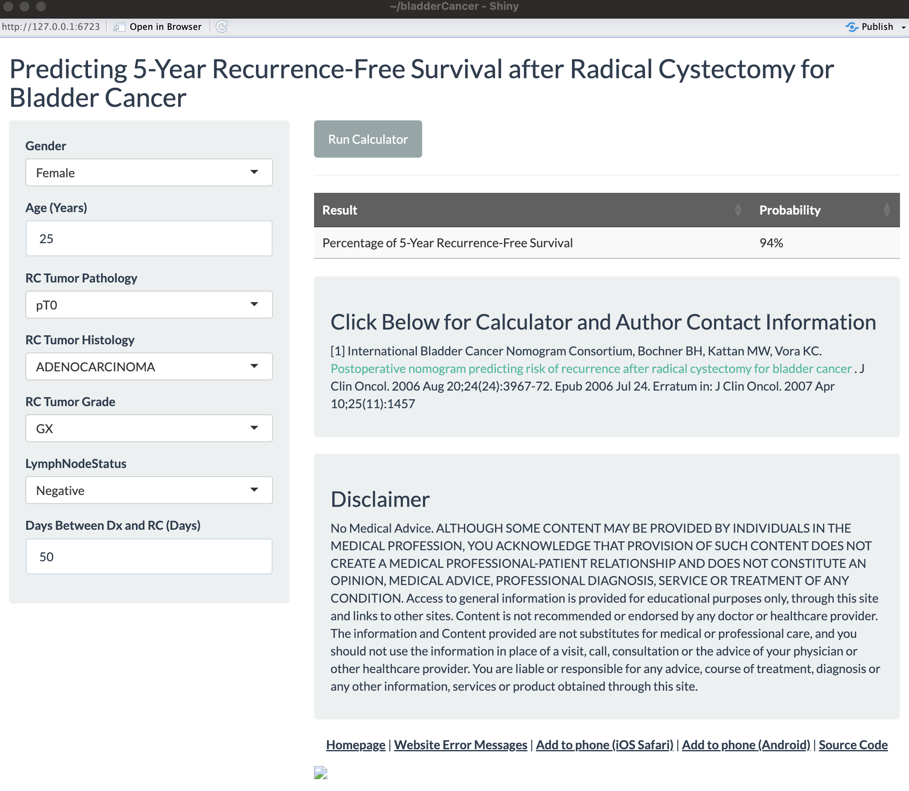

<!-- README.md is generated from README.Rmd. Please edit that file -->

# riskcalc <a href="https://clevelandclinicqhs.github.io/riskcalc/"></a>

<!-- badges: start -->

[](https://github.com/ClevelandClinicQHS/riskcalc/actions/workflows/test-coverage.yaml)
[](https://github.com/ClevelandClinicQHS/riskcalc/actions/workflows/R-CMD-check.yaml)
[](https://CRAN.R-project.org/package=riskcalc)

[](https://lifecycle.r-lib.org/articles/stages.html#experimental)
<!-- badges: end -->

The goal of `riskcalc` is to provide a toolkit for building
[`shiny`](https://www.rstudio.com/products/shiny/)-based risk
calculators for <https://riskcalc.org/>.

## Installation

You can install the development version of `riskcalc` from
[GitHub](https://github.com/) with:

``` r
# install.packages("devtools")
devtools::install_github("ClevelandClinicQHS/riskcalc")
```

# Example

Let’s go through an example of how we can use the `risk_calculator`
function to replicate the functionality of the existing [Bladder
Cancer](https://riskcalc.org/bladderCancer/) risk calculator on the
<https://riskcalc.org> website. Currently, it is setup to receive a
[`glm`](https://www.rdocumentation.org/packages/stats/versions/3.6.2/topics/glm)
or
[`coxph`](https://www.rdocumentation.org/packages/survival/versions/3.5-7/topics/coxph)
object, so we’ll have to build a model first:

``` r
# Load packages
library(riskcalc) 
library(survival)

# Build the model
mod <- 
  coxph(
    formula = Surv(Time, Recurrence) ~ .,
    data = bladderCancer
  )
```

We can just supply the model and a desired prediction time point (since
it’s a survival model) to the `risk_calculator` function, and a
[`shiny`]() app will be constructed that allows for user input for each
predictor in which an individual prediction can be obtained.

``` r
mod |> risk_calculator(time = 5)
```


Now all that is left is formatting to make this application look like
the [real one](https://riskcalc.org/bladderCancer/). We can use the
plethora of additional arguments to adjust accordingly:

``` r
mod |> 
  risk_calculator(
    time = 5,
    title = "Predicting 5-Year Recurrence-Free Survival after Radical Cystectomy for Bladder Cancer",
    citation = 
      htmltools::p(
        "[1] International Bladder Cancer Nomogram Consortium, Bochner BH, Kattan MW, Vora KC.",
        htmltools::a(
          "Postoperative nomogram predicting risk of recurrence after radical cystectomy for bladder cancer",
          href = "http://jco.ascopubs.org/content/24/24/3967.full.pdf"
        ),
        ". J Clin Oncol. 2006 Aug 20;24(24):3967-72. Epub 2006 Jul 24. Erratum in: J Clin Oncol. 2007 Apr 10;25(11):1457"
      ),
    label = "Percentage of 5-Year Recurrence-Free Survival",
    value_header = "Probability",
    format = function(x) paste0(round(100*x), "%"),
    app_name = "bladderCancer",
    labels =
      c(
        Age = "Age (Years)",
        RCTumorPathology = "RC Tumor Pathology",
        RCTumorHistology = "RC Tumor Histology",
        RCTumorGrade = "RC Tumor Grade",
        LymphNodeStatus = "LymphNodeStatus",
        DaysBetweenDXRC = "Days Between Dx and RC (Days)"
      ),
    levels = 
      list(
        Gender = 
          c(
            M = "Male",
            `F` = "Female"
          )
      ),
    placeholders = c(Age = "20-100")
  )
```



Some notes on select arguments:

- `citation`: This is where applications typically display the source
  publication for the risk calculator. It could just be a simple
  character string, but in this case, the
  [`htmltools`](https://cran.r-project.org/web/packages/htmltools/index.html)
  package is used to add text that contains a hyperlink to the
  publication.
- `format`: This is a transformation that can be applied to the default
  result value for preferred display. For a `coxph` object, by default,
  the *survival* probability (which is what we want) is computed at the
  specified `time` point (in this case, 5-years), but we added some
  rounding and tacked on a `%` symbol. For a `glm` object, the default
  output is the predicted value where `type = "response"` (see
  `?predict.glm`)
- `app_name`: We use short-hand names for applications in their URL at
  [riskcalc.org](https://riskcalc.org/) (e.g.,
  <https://riskcalc.org/bladderCancer/>). Recently, the source code for
  applications were
  [added](https://github.com/ClevelandClinicQHS/riskcalc-website) to our
  [QHS GitHub](https://github.com/clevelandclinicqhs) page. Part of that
  was to add source code links back to GitHub within the apps
  themselves. So when this argument is used, it will automatically add
  the source code link to the assumed spot that it would be on GitHub
  (see bottom-right of screenshot above).
- `placeholders`: Adds restrictions for what values can be entered into
  the numeric predictor inputs. It adds the background text so the user
  can see the range, but it also enforces this restriction with the
  [`shiny::validate`](https://shiny.posit.co/r/reference/shiny/0.11/validate.html)
  function.
